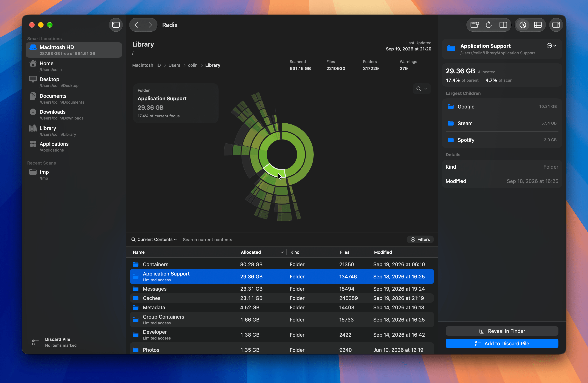
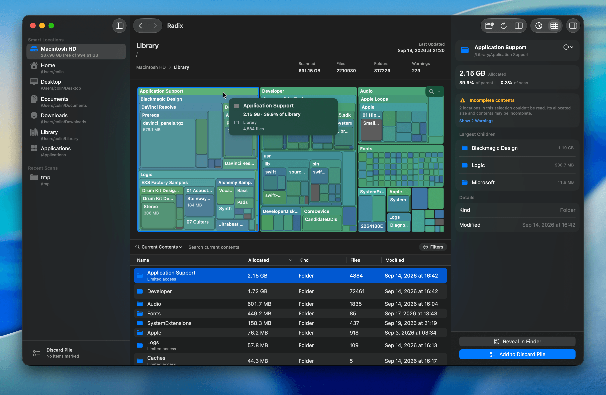
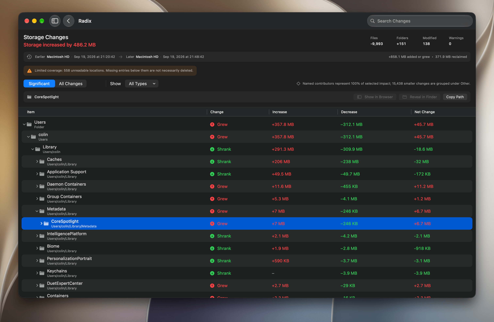

<div align="center">
  
</div>

<h1 align="center">Radix</h1>

A fast, native macOS disk space analyzer that makes crowded drives easy to understand. Scan folders and volumes, explore where your storage is going, compare results over time, and safely clean up — all without leaving the app. Visit the [Radix website](https://tryradix.app) to learn more!

## Why Radix?

Storage fills up quietly. Radix makes it obvious where it went — no Terminal commands, no waiting through scans that crawl forever. Point it at a folder, sit back, and explore a clean visual breakdown of directories and files.

It's built with Swift and SwiftUI, designed to feel like a natural part of macOS.

## Highlights

### Visualize Disk Usage

Switch between **sunburst** and **treemap** views to understand how space is distributed. Hover over an item to inspect it, then double-click a folder to drill deeper.

|                                  Sunburst                                  |                                 Treemap                                  |
| :------------------------------------------------------------------------: | :----------------------------------------------------------------------: |
|  |  |

### Browse and Search

Use the sortable file browser to inspect items, search the current focus or the entire scan, and filter by item kind or allocated size. Preview files with Quick Look and navigate scans with breadcrumbs and back/forward navigation.

### Compare Scans Over Time

Compare two scans to see which files and folders grew, shrank, appeared, or disappeared.



### Review Cleanup Candidates

Add items from the disk map, file browser, or inspector to the **Discard Pile**. Review everything together before deciding whether to move anything to the Trash.

### Save and Reopen Results

Export completed scans as compact, losslessly compressed `.radixscan` snapshots and reopen them later as read-only results.

## More Features

- Fast, iterative file-system scanning with live progress
- Faster follow-up scans by reusing previous results when possible
- Automatic summarization of directories containing thousands of tiny files
- Custom scan exclusions for paths you do not want to include
- Optional free-space display in disk maps
- Smart Locations for mounted volumes, Home, Desktop, Documents, Downloads, Library, and Applications
- Recent scan history in the sidebar
- Detailed inspector with sizes, access information, parent directory, and largest children
- Usage stats showing scans completed, data scanned, scan speeds, chart interactions, and cleanup totals — all stored locally on your Mac
- Reveal in Finder, Copy Path, Move to Trash, and more actions
- Drag and drop a folder into the window to start scanning
- APFS-aware storage accounting that avoids double-counting full clones and detects partial clones
- Welcome flow with an onboarding and an interactive tour of the app
- Available in English, German, Spanish, French, Italian, Russian, and Simplified Chinese
- Automatic updates powered by [Sparkle](https://sparkle-project.org/)

### Privacy & Permissions

Radix works out of the box on any folder you can already access. For some folders, the app may require **Full Disk Access**. Radix detects when files are skipped due to permissions and guides you through enabling them in System Settings.

## Installation

Radix requires **macOS Sonoma 14 or later**.

### Homebrew

```bash
brew install --cask radix
```

### Manual Installation

Download the latest version from [Releases](https://github.com/colinvkim/Radix/releases/latest) or the [Radix website](https://tryradix.app), then drag Radix into your Applications folder.

## Developer Documentation

<details>
<summary>View build instructions, project structure, and architecture</summary>

## Building from Source

Building Radix requires **Xcode 26 or later** with a Swift 6.2 toolchain.

Clone the repository and run the Swift package tests:

```bash
git clone https://github.com/colinvkim/Radix.git
cd Radix
swift test
```

Open `Radix.xcodeproj` in Xcode to build and run the complete app, or build it from the command line:

```bash
xcodebuild \
  -project Radix.xcodeproj \
  -scheme Radix \
  -configuration Debug \
  -destination 'platform=macOS' \
  build
```

The SwiftPM package contains `RadixCore` and its Swift Testing suite. The shared Xcode scheme runs the same core tests: use **Product → Test** (Cmd-U), or replace `build` with `test` in the command above.

## Project Structure

```text
Radix/
├── Radix/                    # App and core source code
│   ├── App/                  # App entry point, commands, and window management
│   ├── Models/               # Scan targets, node records, snapshots, and safety models
│   ├── Services/             # Scanning, archives, comparison, geometry, and formatting
│   ├── ViewModels/           # Application state and UI coordination
│   ├── Features/
│   │   ├── Comparison/       # Scan comparison setup and results
│   │   ├── DiscardPile/      # Cleanup candidate review
│   │   ├── FileList/         # Sortable file browser
│   │   ├── Inspector/        # Single- and multiple-selection details and actions
│   │   ├── Onboarding/       # Welcome flow, permission guidance, and workspace tour
│   │   ├── Settings/         # Scan, visualization, and app preferences
│   │   ├── Sidebar/          # Smart Locations, recent scans, and Discard Pile
│   │   ├── Visualization/    # Sunburst and treemap views
│   │   └── Workspace/        # Main scanning and exploration interface
│   └── Shared/               # Reusable SwiftUI components and helpers
├── RadixCoreTests/           # Unit, integration, and benchmark-style tests
├── Package.swift             # RadixCore Swift package definition
└── Radix.xcodeproj/          # Complete macOS app project
```

## Architecture

- `ScanEngine` is an actor-based asynchronous scanner that uses iterative file-system traversal. `ScanCoordinator` owns scan state, while `IncrementalScanService` reuses prior results when it can safely reconcile filesystem changes.
- `AppModel` is the central `@MainActor` state and coordination layer for the application.
- `ScanSnapshot` and `FileTreeStore` represent scan results using flat tree storage and indexed lookups.
- Archive and comparison services stream, validate, and compare `.radixscan`
  snapshots. Format v5 losslessly compresses the large node and topology
  sections with LZFSE while retaining v3/v4 import compatibility.
- Sunburst and treemap services separate layout and interaction models from their SwiftUI presentation.
- `RadixCore` has no external Swift package dependencies. The app uses Sparkle for updates.

</details>

## Contributing

Contributions are welcome! Here's how to get started:

1. Fork the repository and create a feature branch. Before getting started, consider reviewing the developer documentation above for build instructions and an overview of the project’s structure and architecture.
2. Make your changes and add or update tests where appropriate. Keep them focused and well-documented.
3. Run `swift test`.
4. Open a pull request explaining what changed and why.

Use [Conventional Commits](https://www.conventionalcommits.org/) for commit messages and PR titles. If you're tackling something big, consider opening an issue first so the approach can be discussed.

## License

Radix is available under the [MIT License](LICENSE).
